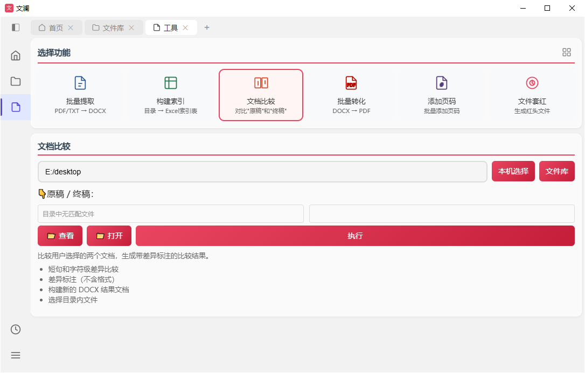
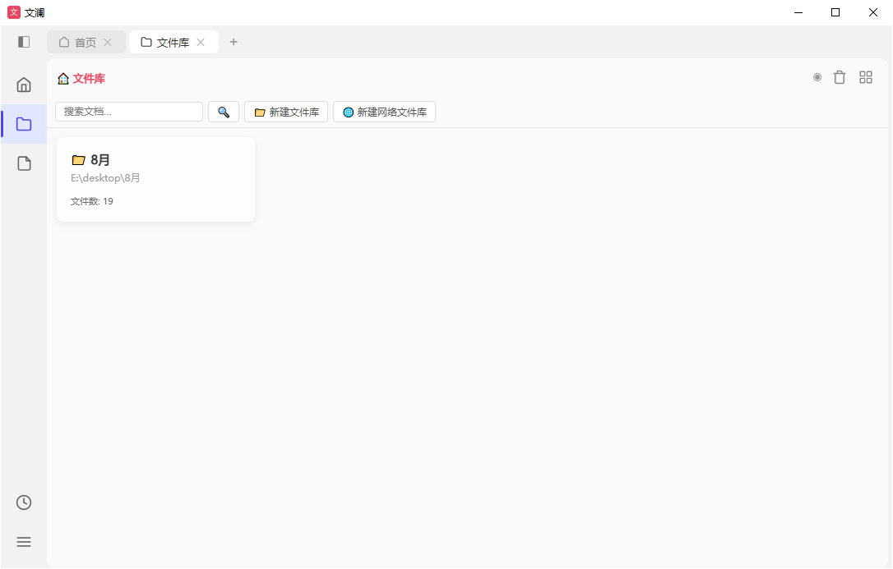

# 功能详解

- [回到首页](index.html) · [快速上手](guide.html)

## 📄 文档处理工具集

面向中文公文场景的工具，命令行可独立使用，也可在应用内流式执行：

| 工具 | 功能 | 技术要点 |
|------|------|----------|
| 文档比对 | 文档差异对比 | 三级 diff（段落/句子/字符），红蓝高亮标记 |
| 红头文件 | 生成红头公文 | 套红标题、浮动印章、发文代字/文号 |
| 转 DOCX | 多格式转 Word | PDF / DOC / DOCX / TXT / HTML / MD |
| 转 PDF | 批量转 PDF | LibreOffice / win32com 双引擎 |
| 批量页码 | DOCX 加页码 | XML 级 PAGE 域操作 |
| 目录索引 | 扫描目录出清单 | 递归扫描输出 Excel 索引 |

  

## 🗂️ 文件库管理

本地文件的集中管理空间：

- **文件库 CRUD**：创建、复制、重命名、删除（进回收站）
- **回收站**：列表、恢复、永久删除
- **文件操作**：上传、下载（Zip 打包）、批量下载、在线编辑/预览、重命名、移动、复制、新建目录
- **工具集成**：文件右键直接调文档工具，SSE 流式执行按类型过滤
- **同步知识库**：文件库 → 知识库自动增量同步（FTS5 索引，不落盘 .md）
- **格式转换**：批量 .doc → .docx

  

## 🧠 知识库系统

AI 核心模块，基于 LLM 的协作知识库：

- **文件管理**：Markdown CRUD、目录树、FTS5 全文检索
- **对话会话**：多会话、自动标题、90 天保留
- **持久记忆**：系统笔记 + 用户画像，AI 从对话中自动沉淀，带安全扫描
- **技能系统**：技能 CRUD、生命周期管理（active → stale → archived）、LLM 审查器自动合并同类技能
- **上下文压缩**：Token 超限自动摘要，保留首尾关键消息
- **洞察分析**：使用数据概览、活跃模式、热门会话统计
- **自动更新**：自动从对话提取记忆与技能，越用越懂你

## 🌐 P2P 节点共享

- **发现**：zeroconf (mDNS) 局域网自动发现，无需手动填 IP
- **认证**：Ed25519 签名 + TrustStore 信任管理
- **共享**：文件库共享给信任节点，view / edit / manage 三级权限

## 🔄 自动更新

- 版本号唯一源为 `version.py`，发版打 tag 后 GitHub Actions 自动构建
- 客户端启动后延迟检查更新清单，**后台静默下载**安装包（sha256 校验），就绪后提示一键安装
- 可设置跳过某版本、关闭自动下载；降级安装被安装器拦截

## 🔐 数据与隐私

- 单机本地优先，数据存本机用户数据目录；P2P 仅在开启时、经签名认证的节点间共享
- LLM API Key 本地加密存储，不上传任何服务器
- 本仓库**没有**任何后端云服务，所有功能均可离线使用（AI 会话除外）
