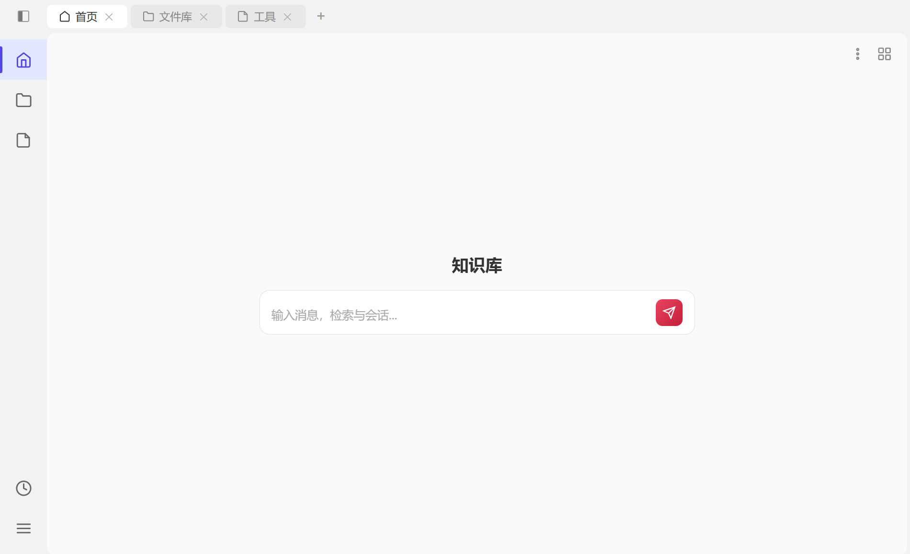

Docflowing（文澜）是一款面向**公文处理与知识管理**的桌面应用，把日常最费时的几类工作——文档处理、文件整理、知识沉淀、跨设备共享——整合进一个**本地优先、可离线**的工具箱。

无论你是需要反复比对合同与红头文件的文秘、要在大量资料中快速检索的科研 / 法务人员，还是想把团队文档沉淀为可对话知识库的管理者，文澜都能在同一个窗口里完成，避免在不同软件之间反复切换、复制粘贴。四大模块彼此打通：文件在「文件库」集中管理，一键同步进「知识库」成为可对话、可检索的知识资产，再用「文档工具集」加工输出，需要协作时通过「P2P 共享」安全分发。

基于 **pywebview 桌面壳 + Python Flask 后端 + 原生 JS 前端**，安装包小巧、启动快、Windows 全功能支持，所有数据默认留在你自己的机器上，AI 密钥本地加密存储。

  

## 快速入口

- 💾 [下载安装](https://github.com/doonly1/Docflowing/releases/latest) —— 最新版安装包
- 🚀 [快速上手](guide.html) —— 安装、使用与常见问题
- 🧩 [功能详解](features.html) —— 工具集 / 文件库 / 知识库 / P2P 介绍
- 📄 [项目主页](https://github.com/doonly1/Docflowing) —— 源码、Issue 与 Release

## 核心亮点

| 模块 | 能做什么 |
|------|----------|
| 📄 **文档处理工具集** | 文档比对（三级 diff 红蓝标注）、红头文件生成、多格式转 DOCX/PDF、批量加页码、目录索引生成 |
| 🗂️ **文件库管理** | 文件库 CRUD、回收站、批量上传下载、在线编辑预览、工具流式执行、文件库→知识库自动同步 |
| 🧠 **知识库系统** | AI 对话会话、FTS5 全文搜索、持久记忆、技能管理与自动进化、上下文压缩、洞察分析 |
| 🌐 **P2P 共享** | 局域网节点自动发现（mDNS）、Ed25519 签名认证、文件库多级权限共享 |

> AI 功能需自行配置 OpenAI 兼容的 LLM API（知识库 → LLM 设置），密钥在本地加密存储。

## 功能模块一览

### 🗂️ 文件库管理

文件库是文澜的「本地中枢」：集中存放文档，支持回收站、批量上传 / 下载、在线编辑与预览；文件可一键同步到知识库，让后续的 AI 检索与对话建立在你自己的资料之上。

  

### 📄 文档处理工具集

面向中文公文场景的工具集，命令行可独立使用，也可在应用内流式执行：文档比对、红头文件、转 DOCX / PDF、批量页码、目录索引，覆盖从整理到出稿的全流程。

  

## 赞助支持

如果这个项目对你有帮助，欢迎请作者喝杯咖啡 ☕

  

微信 / 支付宝 扫码支持

## 许可证

Copyright © 2026 doonly1. Licensed under the **AGPL-3.0**（详见 [LICENSE](https://github.com/doonly1/Docflowing/blob/main/LICENSE)）。
